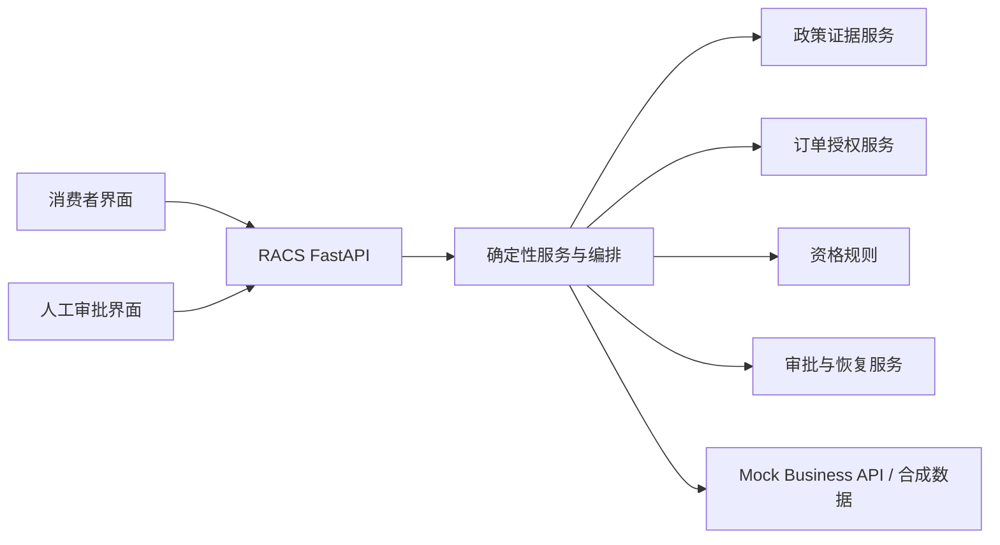

# RACS 技术架构

## 1. 文档目的与阅读口径

本文同时记录 RACS 的**当前实现**与后续演进目标。只有“当前实现”章节描述已经存在且经测试覆盖的能力；“未来规划”不构成已交付能力、发布证据或运行时承诺。

当前版本是使用固定合成数据的确定性、进程内演示。它不执行真实退款、支付、物流或订单变更。

## 2. 当前实现

### 2.1 运行形态

- 单仓库 Python/FastAPI 后端和 React/Vite 前端。
- 消费者与审批页面经最小 HTTP API 调用进程内服务；浏览器仅提交消息或审批操作，身份、订单事实、资格、审批和申请状态由服务端组件决定。
- `Mock Business API` 使用 T-001 固定合成订单与模拟售后申请数据。
- 会话、审批、恢复检查点和模拟申请使用进程内仓储；后端重启会丢失这些运行状态，不是跨进程持久化恢复。
- 当前没有生产认证、持久数据库、PostgreSQL、迁移、SSE/EventSource、后台 worker、完整 LangGraph 图或通用 Agent。

### 2.2 已实现模块边界

| 模块 | 当前职责 | 当前限制 |
| --- | --- | --- |
| `routing`、`collection` | 受限词表的诉求路由、字段收集和更正 | 不是开放式 NLP 或 Agent |
| `rag` | 固定政策数据过滤、引用绑定和安全降级 | 不使用向量数据库或知识运营后台 |
| `tools`、`mock_business` | 服务端身份上下文下的订单授权与模拟申请 | 只处理合成数据，不是真实外部系统 |
| `eligibility`、`response_gate` | 确定性资格、风险和最终回复证据校验 | 不做模型业务决策 |
| `approvals`、`recovery`、`orchestration` | 进程内人工审批、检查点和受控续办 | 不提供跨进程/数据库恢复 |
| `model_gateway` | DeepSeek 适配与确定性 Fake 的独立专项评测 | 消费者和审批演示路径不依赖模型 API |
| `interfaces/api`、`web` | 最小 HTTP 会话/审批 API 与两个页面 | 无 SSE、持久历史或生产身份认证 |
| `acceptance_reporting` | 固定合成验收运行器和失败样本报告 | 不是生产监控或评测平台 |

### 2.3 业务安全边界

1. 模型最多提供候选意图、字段、更正或受已有证据约束的语言草稿；其输出必须经 Schema 校验。
2. 订单归属、资格、风险、审批、申请创建和质量门禁由确定性服务完成，不能由模型或浏览器请求决定。
3. 公开政策回答绑定本次检索的可信政策证据；最终回复门禁绑定订单、资格、审批和模拟申请事实。
4. 高风险流程只在可信审批人决定后调用受控恢复路径；重复操作依赖稳定业务键和仓储状态避免第二条模拟申请。
5. 不能确认写入、引用、版本或恢复状态时返回安全失败、澄清或人工处理，不虚构完成。

## 3. 当前公开接口

当前 FastAPI 仅提供演示所需的会话、审批与健康检查接口。消费者会话支持读取当前进程内快照；审批页面读取同一进程内的可信任务并提交决定。接口不提供 SSE、跨进程会话恢复、数据库查询 API 或持久化评测结果 API。

实际启动、已验证命令和 Docker 未验证边界见 [README](README.md) 与 [启动指南](docs/demo/STARTUP.md)。

## 4. 证据与测试

固定合成数据、固定验收用例和单元/组件测试覆盖政策、订单、资格、申请、路由、收集、审批、恢复、最终回复和两类界面路径。真实 DeepSeek 适配仅通过 T-204 独立专项评测；它不是消费者或审批演示的依赖。

测试结果、已知失败样本和发布限制以 `TASKS.md`、`docs/task-reports/`、`docs/CHANGELOG.md` 与 `docs/RELEASES.md` 的实际记录为准。

## 5. 未来规划（未实现）

以下方向来自初始产品架构目标，当前均未实现，不能在演示或发布材料中表述为已有能力：

- PostgreSQL 持久化、数据库迁移、跨进程检查点和审计存储；
- SSE/EventSource、事件重放、后台 worker 与生产部署拓扑；
- 完整 LangGraph 工作流、Agent、工具调度平台和知识管理后台；
- 生产认证、多租户授权、真实订单/退款/物流系统与生产监控。

任何一个方向都需在独立后续任务中说明范围、数据安全、迁移方案和验收证据后才可实现。
