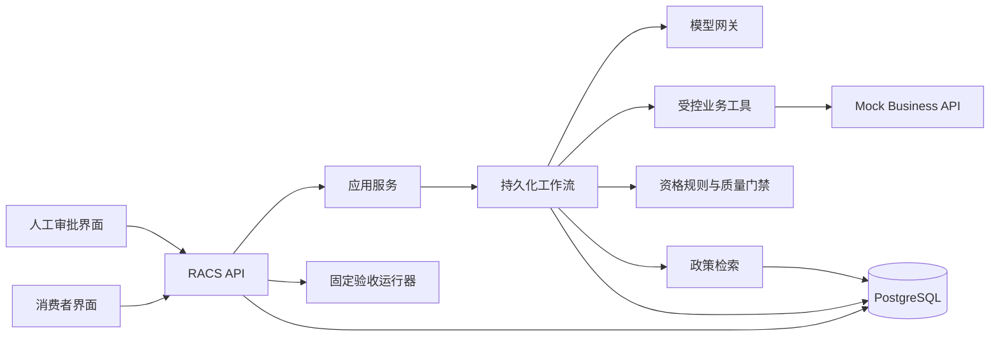
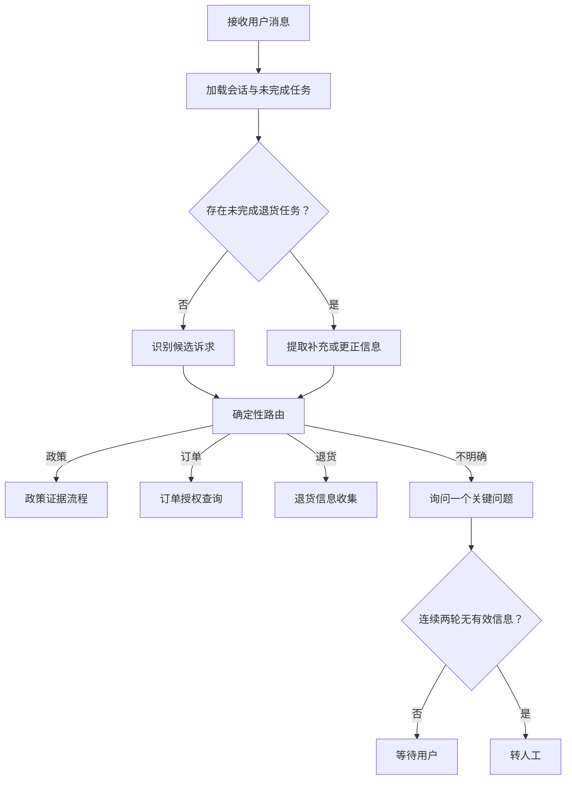
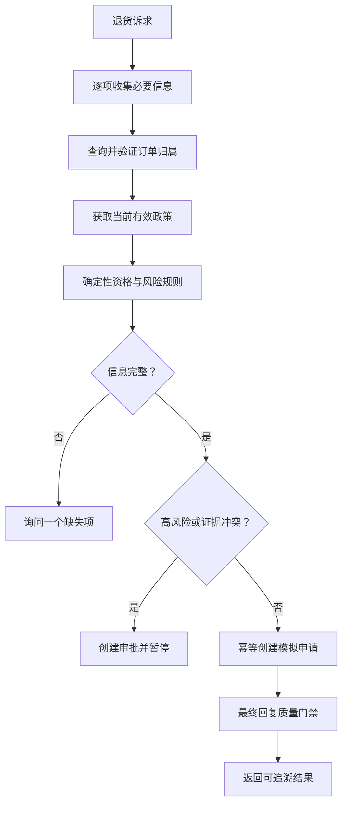

# RACS 技术架构

## 1. 文档目的

本文根据 `PROJECT.md`、`REQUIREMENTS.md` 和 `TASKS.md` 设计可恢复式 AI 售后客服（RACS）第一版本的技术架构。本文只规定如何实现既有产品需求，不新增或修改产品范围。

技术栈、依赖类别和版本策略见 `TECH_STACK.md`。

## 2. 架构目标与约束

### 2.1 架构目标

- 支持政策咨询、订单查询、标准退货和未知诉求四类路由。
- 支持多轮信息收集、用户更正、页面刷新和服务重启后的任务恢复。
- 确保政策结论、订单事实、资格判断、审批结果和执行状态均可追溯。
- 将自然语言理解与确定性业务决策分离，禁止模型自由决定退货资格。
- 高风险或证据不足时暂停自动流程，等待人工审批或人工接管。
- 对创建申请、提交审批和恢复任务提供幂等保护。
- 使用固定合成数据和可重复测试证明正常、边界及失败行为。

### 2.2 产品边界

- 所有用户、订单、政策和售后申请均为合成或模拟数据。
- 售后申请是模拟创建，不执行真实退款、支付、物流或订单变更。
- 第一版本不建设多租户、复杂组织权限、知识运营后台、全渠道客服或通用 Agent 平台。
- 不保存或展示模型隐藏推理；只保存结构化结果、证据和可审计原因码。

### 2.3 核心原则

1. **确定性代码拥有业务决定权**：权限、资格、风险、审批状态和完成状态不由模型决定。
2. **状态先于对话文本**：工作流以持久化结构化状态为事实来源，历史消息只是输入之一。
3. **证据随结论保存**：最终结论引用本次实际使用的政策、订单、规则、审批或操作记录。
4. **写操作默认幂等**：网络重试、重复提交和恢复不得产生第二个售后申请。
5. **失败安全**：无法证明成功、无法恢复或证据冲突时暂停、澄清或转人工。
6. **模块化单体优先**：以清晰模块边界保持可测试性，避免首版分布式系统复杂度。

## 3. 总体架构

第一版本采用单仓库、前后端分离的模块化单体。主后端负责 API、工作流、领域规则、知识检索和持久化；Mock Business API 模拟订单与售后系统，并保持独立接口边界。



### 3.1 部署单元

| 单元 | 职责 | 是否包含真实外部业务 |
| --- | --- | --- |
| Web | 消费者对话页与人工审批页 | 否 |
| RACS API | 接口、应用服务、工作流、规则、检索与门禁 | 否 |
| PostgreSQL | 会话、任务、检查点、证据、审批、幂等与评测数据 | 否 |
| Mock Business API | 模拟订单查询和售后申请创建 | 否，仅合成数据 |

首版不引入消息队列、Redis、服务网格或独立向量数据库。需要等待人工的任务通过数据库状态与工作流检查点恢复，不占用后台线程。

## 4. 模块边界

```text
interfaces/       HTTP API、SSE、DTO、错误映射、演示身份
application/      会话、审批、评测等用例协调与事务边界
workflow/         状态机、节点、路由、中断、恢复和重试策略
ai/               模型网关、提示、结构化输出和测试替身
domain/           资格规则、风险策略、状态约束和回复质量门禁
knowledge/        政策导入、过滤、检索、证据与引用组装
tools/            订单与售后工具端口、权限上下文和统一结果信封
infrastructure/   数据库、模型、HTTP Client、日志和配置实现
evaluation/       固定用例、运行器、断言、报告和版本信息
mock_business/    合成订单与模拟售后申请 API
```

依赖方向为 `interfaces → application → workflow/domain`。领域层不依赖 Web 框架、工作流框架、模型 SDK 或数据库实现；基础设施层实现内层定义的端口。

## 5. AI 与确定性能力边界

### 5.1 模型允许执行

- 从用户消息中识别候选诉求和结构化字段。
- 在已有任务上下文中识别补充或更正信息。
- 基于经过筛选的政策证据生成自然语言草稿。
- 根据结构化事实生成会话摘要和用户可读说明。

所有模型输出必须通过类型化 Schema 校验。意图置信度不足、字段含义不明确或 Schema 修复失败时，不触发业务写操作。

### 5.2 模型禁止执行

- 判断订单是否属于当前用户。
- 自由决定退货资格、风险等级或审批要求。
- 直接访问数据库或调用未授权函数。
- 伪造政策来源、订单字段、申请编号或完成状态。
- 绕过审批、修改已处理审批或自行认定中断任务已完成。

### 5.3 确定性组件

| 组件 | 输入 | 输出 |
| --- | --- | --- |
| Intent Router | 当前状态、结构化意图结果 | 白名单下一步或澄清 |
| Order Authorization | 用户上下文、订单号 | 已授权事实或非泄露错误 |
| Eligibility Engine | 订单、原因、商品状态、政策、阈值 | 资格、规则、缺失项、风险 |
| Risk Policy | 资格结果、金额、证据状态 | 自动处理或审批原因 |
| State Transition Guard | 当前状态、事件 | 允许或拒绝状态迁移 |
| Response Gate | 草稿与所有依据 | 发送、安全改写或升级 |

## 6. 核心工作流状态

### 6.1 业务状态

```text
NEW
→ COLLECTING_INFORMATION
→ EVALUATING
→ WAITING_APPROVAL
→ EXECUTING
→ COMPLETED

任意未完成状态可进入 NEEDS_CLARIFICATION、ESCALATED 或 FAILED_SAFE。
```

`COMPLETED` 只能在只读答复已有有效证据，或写操作存在成功记录时进入。`WAITING_APPROVAL` 不等于完成；`FAILED_SAFE` 不推断业务操作结果。

### 6.2 持久化 WorkflowState

| 字段组 | 主要内容 |
| --- | --- |
| 标识 | conversation_id、workflow_id、workflow_version |
| 身份 | user_id、角色、脱敏权限上下文 |
| 当前任务 | intent、stage、clarification_count |
| 已确认信息 | order_id、return_reason、item_condition、修订版本 |
| 业务事实 | 授权订单快照及来源请求 |
| 政策证据 | 文档、版本、片段、有效期、匹配分数 |
| 业务判断 | 资格、命中规则、缺失项、风险原因、规则版本 |
| 审批 | 审批 ID、状态、决定、备注、处理人和时间 |
| 工具执行 | 动作、幂等键、请求、结果、最终状态 |
| 回复 | 草稿、门禁结果、公开回复 |
| 错误 | 稳定错误码、是否可重试、处理结果 |

业务状态与审计事件使用同一应用数据库事务保存，并作为业务事实来源。LangGraph 检查点是可恢复执行快照，不承诺与应用事务形成跨框架原子提交；恢复时若检查点与业务状态不一致，以业务状态和审计记录校验并重建安全恢复上下文，无法确认时进入 `FAILED_SAFE`。消息记录不保存隐藏思维链。

## 7. 主要流程

### 7.1 消息处理与路由



已有退货任务优先于重新分类。每轮只询问一个最影响下一步判断的缺失项；用户更正后产生新字段版本并记录关键变化。

### 7.2 政策咨询

1. 从问题和已确认商品类别构造检索条件。
2. 先按发布状态和有效期过滤，再检索候选片段。
3. 检测无结果、过期结果和互相冲突的有效来源。
4. 仅将本次选中的证据交给模型形成草稿。
5. T-101 政策服务在公开返回前，将草稿中的引用逐字段绑定到本次实际选中的当前政策证据。
6. 引用无法绑定时返回 `UNGROUNDED_CITATION` 安全降级；其他证据不足场景澄清或升级，不给出确定结论。
7. T-303 将来再由通用 Response Gate 校验跨政策、订单、资格、审批和业务执行状态的最终回复。

第一版本的政策导入使用受控合成数据，不提供知识管理界面。

### 7.3 订单查询

1. 缺少订单号时请求补充，不调用查询工具。
2. 工具请求同时携带当前 `user_id` 与 `order_id`。
3. Mock Business API 在数据源边界执行归属校验。
4. RACS API 再按允许字段白名单生成订单快照。
5. 不存在与无权访问使用不泄露他人订单详情的错误响应。

### 7.4 标准退货



资格引擎显式处理普通退货、质量问题、边界日期、超期、高金额和缺失信息。相同输入与规则版本必须得到相同结果。

### 7.5 人工审批与恢复

1. 高风险结果创建唯一审批任务，并保存会话摘要、订单快照、政策证据、规则结果和升级原因。
2. 工作流提交 `WAITING_APPROVAL` 检查点后结束当前请求。
3. 人工只能对 `PENDING` 审批执行批准、调整或拒绝；使用乐观锁防止重复处理。
4. 审批事务提交后，审批 API 在同一 HTTP 请求中显式调用工作流恢复入口；恢复逻辑重新读取原工作流、已提交的审批结果和已有工具执行，不依赖消息队列或后台线程。
5. 批准路径从中断点继续；调整路径使用人工确认后的结构化建议；拒绝路径不创建申请。
6. 工作流版本不兼容、审批数据缺失或写操作状态未知时进入 `FAILED_SAFE` 并转人工。

## 8. 幂等、一致性与并发

### 8.1 幂等键

创建模拟申请使用稳定业务键：

```text
return-request:{workflow_id}:{order_id}:{order_item_id}
```

第一版本规定一个退货工作流只处理一个订单中的一个目标商品，并且最多创建一个售后申请。多商品退货必须拆分为独立工作流，不在首版中合并处理。

同一业务键在数据库和 Mock Business API 中均具有唯一约束。重复提交返回首次成功结果；不得通过生成新随机键绕过重复保护。

### 8.2 写操作状态

```text
PENDING → SUCCEEDED
PENDING → FAILED_CONFIRMED
PENDING → UNKNOWN
```

超时后先按幂等键查询最终状态。只有确认失败且错误允许重试时才能重试；`UNKNOWN` 必须暂停并人工确认，不能声明成功或立即重复写入。

### 8.3 并发控制

- 会话和审批记录使用版本号进行乐观并发控制。
- 已处理审批不可再次变更。
- 状态迁移以数据库事务和合法迁移校验共同保护。
- SSE 连接断开不撤销已经提交的状态或写操作。

## 9. 最终回复质量门禁

回复先生成结构化 `ResponseDraft`，其中声明与证据 ID 显式关联。门禁逐项校验：

- 政策结论引用本次有效政策证据；
- 订单事实存在于已授权订单快照；
- 资格结论等于资格引擎结果；
- “已创建”或“已完成”存在成功工具执行记录；
- 高风险结论存在有效且终态的人工审批；
- 回复不含隐藏推理、内部堆栈、敏感标识或数据源未返回字段。

门禁结果只有：

- `ALLOW`：发送经过校验的公开回复；
- `SAFE_REWRITE`：删除未经支持的表达，不修改业务事实；
- `CLARIFY`：继续收集信息；
- `ESCALATE`：暂停并转人工。

### 9.1 T-101 政策绑定与 T-303 通用门禁边界

T-101 已实现的边界仅位于 `PolicyAnswerService.answer()` 内部。服务将按类别、原因、状态和有效期取得的政策保留为可信证据集合；答案组装完成后、公开返回前，逐字段核对政策 ID、证据 ID、政策版本、来源、有效期和内容摘录，并确认政策在查询日期仍然有效。引用不是本次检索和当前答案实际使用的政策时，服务清空答案与引用并返回 `INSUFFICIENT_EVIDENCE / UNGROUNDED_CITATION`，不尝试修改或补造业务事实。

该政策专用校验不读取订单、资格、审批或工具执行状态。T-303 现提供独立的跨领域 `ResponseDraft` 与 `ResponseGateService`：它以服务端注入的可信证据核对政策、订单、资格、审批及申请成功事实，并输出允许、改写、澄清或升级的结构化结果。T-101 仍只负责政策回答内部证据绑定；T-303 不实现 T-304 的完整高风险编排或业务写入。

## 10. 数据架构

### 10.1 主数据实体

| 实体 | 关键职责 |
| --- | --- |
| users | 演示身份与角色 |
| conversations / messages | 会话与公开消息历史 |
| workflows / checkpoints | 当前任务、版本化状态与恢复点 |
| confirmed_slots | 已确认字段及修订历史 |
| policy_documents / policy_chunks | 政策版本、有效期、来源与检索内容 |
| evidence_snapshots | 某次判断实际使用的不可变证据 |
| eligibility_decisions | 规则输入摘要、结果和规则版本 |
| approval_tasks | 待审批上下文、决定和并发版本 |
| tool_executions | 幂等键、请求状态与最终结果 |
| audit_events | 关键状态迁移和人工操作 |
| evaluation_cases / evaluation_runs | 固定用例、预期、实际和版本信息 |

Mock Business API 拥有独立的合成 `orders`、`order_items` 和 `service_cases` 数据。主应用不得跨边界直接查询其表。

### 10.2 保留与脱敏

- 仅保存演示所需的合成数据。
- 日志不记录完整模型密钥、认证令牌或未脱敏请求体。
- 公开 API DTO 与内部数据库模型分离，默认拒绝未声明字段输出。
- 证据快照保存来源标识和必要片段，不保存模型隐藏推理。

## 11. API 设计

```text
POST   /api/v1/conversations
GET    /api/v1/conversations/{conversation_id}
GET    /api/v1/conversations/{conversation_id}/events
POST   /api/v1/conversations/{conversation_id}/messages

GET    /api/v1/approvals
GET    /api/v1/approvals/{approval_id}
POST   /api/v1/approvals/{approval_id}/decision

GET    /api/v1/evaluations/runs
GET    /api/v1/evaluations/runs/{run_id}

GET    /health/live
GET    /health/ready
```

浏览器进入会话后，先通过 `GET /conversations/{conversation_id}/events` 建立原生 EventSource 连接，再使用独立的 `POST /messages` 提交用户消息。POST 请求同步推进工作流，直到完成或到达已持久化的等待补充、等待审批、失败安全状态；执行期间产生的状态通过已有 SSE 连接发送。该方式不依赖后台 worker。

POST 响应返回 `workflow_id`、本次运行到达的状态和公开结果摘要。人工审批 POST 也采用相同原则：提交审批事务后同步恢复工作流，直到下一持久化等待点或终态。

每个事件至少包含 `event_id`、`workflow_id`、`type`、`sequence` 和 `payload`。服务端按 `Last-Event-ID` 或等价游标补发仍在保留期内的事件；页面刷新后也可以通过会话查询恢复最终状态。所有错误使用稳定错误码、用户可行动提示和内部关联 ID，不向客户端返回堆栈。

评测执行是显式 CLI 操作，不在 API 进程内启动长时间后台任务。API 只列出和读取已经持久化的评测结果。

演示身份通过固定合成用户会话实现，但订单工具仍必须进行资源归属校验，不能因演示环境省略授权边界。

## 12. 错误处理

| 错误类型 | 处理策略 |
| --- | --- |
| 模型超时或临时错误 | 有限重试；仍失败则澄清或转人工 |
| 模型结构化输出无效 | 最多一次结构修复；禁止触发写操作 |
| 政策无结果、过期或冲突 | 不给确定结论；澄清或审批 |
| 订单缺失、不存在或越权 | 返回对应非泄露错误，不构造字段 |
| 只读工具暂时失败 | 有限重试并显示可行动状态 |
| 写工具超时 | 按幂等键查询；未知则安全暂停 |
| 检查点损坏或版本不兼容 | 禁止猜测恢复，保留记录并转人工 |
| 并发审批或状态冲突 | 返回已有终态或冲突响应，不重复执行 |

所有循环和重试均有明确上限。连续两轮澄清仍无法获得有效信息时转人工。

## 13. 安全设计

- API 层验证演示用户身份和角色；工具层再次验证订单归属。
- 模型只能调用节点允许的静态工具白名单。
- 政策文档视为非可信输入，不能覆盖系统指令或取得工具权限。
- Prompt 只接收完成任务所需的最小字段，并限制输入与上下文长度。
- 审批决策记录处理人、时间、原状态、新状态和备注。
- 对越权订单、提示注入、伪造引用、伪造执行结果和审批绕过建立回归测试。

## 14. 可观测性与审计

每个请求使用 `trace_id`，并关联：

```text
conversation_id → workflow_id → checkpoint_id
→ model_call / retrieval / tool_execution / approval → response
```

P0 记录结构化日志、耗时、状态迁移、错误码、模型配置版本、Prompt 版本、规则版本和数据集版本。业务审计事件与调试日志分离；审批和模拟申请操作必须进入不可遗漏的业务审计记录。

## 15. 测试与验收架构

| 层级 | 覆盖内容 |
| --- | --- |
| 单元测试 | 规则边界、状态迁移、字段更正、门禁和错误映射 |
| 组件测试 | 政策过滤与检索、模型适配器、仓储、工具 Client |
| 工作流测试 | 四类诉求、两轮澄清、标准退货、三类审批决定 |
| 集成测试 | API、数据库、Mock API、检查点、幂等与并发冲突 |
| E2E | 标准退货；审批中断、重启、恢复并仅创建一次申请 |
| 安全测试 | 越权、无依据回答、虚假完成、提示注入和审批绕过 |

固定验收用例包含前置条件、输入、预期过程和唯一预期终态。每次运行记录代码版本、数据版本、政策版本、规则版本、Prompt 版本、模型和随机参数；报告区分预期、实际、通过、失败及失败原因，并保留至少一个真实失败案例。

模型测试使用确定性替身覆盖流程语义；真实模型用例作为单独评测集通过 CLI 运行，避免基础回归测试依赖外部模型波动。P0 前端自动化只要求关键交互测试和两条 Playwright 主链路，不追求广泛组件单测。

## 16. 部署与运行

本地和演示环境使用容器编排启动：

```text
web
racs-api
postgres
mock-business-api
```

数据库迁移、合成数据初始化、政策索引和固定验收均提供可重复 CLI 命令。健康检查区分进程存活与数据库、Mock API 等必要依赖就绪。配置通过环境变量注入，密钥不写入仓库。

## 17. 需求追踪

| 需求 | 架构承载 |
| --- | --- |
| FR-01 | 持久化 WorkflowState、检查点、状态迁移与恢复 |
| FR-02 | AI 结构化识别、确定性路由、澄清计数器 |
| FR-03 | 有效期过滤、政策检索、证据快照、引用门禁 |
| FR-04 | 双层归属校验、字段白名单、非泄露错误 |
| FR-05 | confirmed_slots、字段版本、更正记录、单项澄清 |
| FR-06 | Eligibility Engine、Risk Policy、版本化规则 |
| FR-07 | Mock Business API、幂等键、工具执行状态确认 |
| FR-08 | approval_tasks、持久化中断、乐观锁和同步恢复入口 |
| FR-09 | 结构化 ResponseDraft 与确定性 Response Gate |
| FR-10 | Web 消费者界面、会话 SSE 事件端点和引用展示 |
| FR-11 | Web 审批界面、审批 API 和终态防重 |
| FR-12 | 固定数据集、分层测试、版本化运行与报告 |

## 18. 架构决策与演进边界

### 18.1 交付任务映射

| 任务 | 技术落点 |
| --- | --- |
| T-000 | 运行时与锁文件基线、最小应用入口、配置、质量命令、CI 和 Compose 基础配置 |
| T-001 | 合成业务数据、政策版本、数据版本与数据库 seed |
| T-002 | evaluation_cases、固定前置条件、过程断言与终态断言 |
| T-101 | 政策过滤、检索、证据快照和引用门禁 |
| T-102 | Order Tool、Mock Business API 归属校验和字段白名单 |
| T-103 | Eligibility Engine、Risk Policy 与版本化规则配置 |
| T-104 | service_cases、双端幂等约束和工具执行状态机 |
| T-201 | 结构化意图识别、已有任务优先路由和澄清计数器 |
| T-202 | confirmed_slots、字段修订历史和单项缺失信息策略 |
| T-203 | 标准退货工作流、证据链、质量门禁和唯一申请结果 |
| T-301 | approval_tasks、审批快照、决定 API 和乐观锁 |
| T-302 | 工作流检查点、版本校验、同步恢复入口和写后确认 |
| T-303 | ResponseDraft、Response Gate 和安全输出动作 |
| T-304 | 高风险工作流的暂停、三类决定、恢复与最终审计 |
| T-401 | 消费者 Web、EventSource 事件流、引用和可行动错误 |
| T-402 | 审批列表、详情、决定表单和终态防重复提交 |
| T-403 | 评测 CLI、evaluation_runs、分层断言、失败保留和版本化报告 |
| T-404 | Compose 启动、初始化命令、运行指南和演示所需状态 |

该映射服务于 `TASKS.md` 已规定的执行顺序，不重新排序任务，也不为某项任务增加产品输出。

### 18.2 架构决策记录

实现阶段应为以下决策建立 ADR：

1. 模块化单体而非微服务；
2. 持久化状态机与人工中断恢复；
3. AI 能力与确定性业务规则分离；
4. 双端幂等与写后状态确认；
5. 结构化回复及确定性质量门禁；
6. PostgreSQL 同时承载业务状态与首版政策检索。

P1 的增强检索、知识管理、物流异常、反馈闭环、版本对比和运营分析应在对应产品范围与验收标准补充后单独设计，不能从本文直接推导为首版功能。
