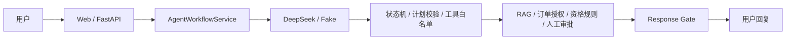

# Recoverable AI Customer Service

受控式 AI 售后客服 Agent：DeepSeek 负责理解、受限计划与证据草稿；状态机、工具白名单、确定性规则、人工审批和 Response Gate 保留最终裁决权。

这是一个面向售后场景的可演示全栈 Agent MVP。它把“模型能说什么”与“系统允许做什么”分开：模型不拥有业务写入或裁决权，用户看到的结论必须来自可追溯的服务端事实。

**当前版本：** [`v1.0.0`](https://github.com/Onlyblue02/recoverable-ai-customer-service/tree/v1.0.0)；Git Tag 已推送到 [GitHub 仓库](https://github.com/Onlyblue02/recoverable-ai-customer-service)，当前尚未创建 GitHub Release 页面。T-601～T-608、Docker 发布验证闭环与订单可信依据展示修复均有 Reviewer PASS。

## 项目截图

> 当前仓库尚未提交可公开截图。请勿使用包含 API Key、真实个人信息、内部路径或日志的截图。

生成公开截图：运行下方本地 Fake 演示，在消费者页面完成一次标准退货或高风险审批流程；仅截取浏览器页面，并确认画面只包含合成订单、公开政策引用、模拟申请编号或“受控的已授权订单记录”来源。建议将图片存为 `docs/assets/consumer-demo.png` 或 `docs/assets/approval-demo.png` 后再替换本占位。

## 核心能力

- **政策 RAG 与可信引用**：只使用当前、无冲突的政策证据；缺少或冲突证据时安全降级，不编造引用。
- **订单授权与确定性资格规则**：订单归属、商品行、资格和风险由服务端确定性逻辑裁决；越权与不存在不泄露订单事实。
- **DeepSeek 受控计划与回复草稿**：DeepSeek 仅生成受 Schema 限制的理解、计划候选和证据草稿；默认 Fake 演示无需模型 Key。
- **高风险人工审批**：高价值或例外退货进入审批—检查点—受控恢复路径；批准、调整、拒绝和重复操作均受服务端保护。
- **安全对抗防护**：覆盖提示注入、越权订单、伪造审批/证据、缺失检查点、批准前写入与未知写入结果等场景。

## 架构：模型不掌握最终决定



DeepSeek 或 Fake 的输出只是候选；`AgentWorkflowService` 串联状态机、计划校验、受控工具与证据。`Response Gate` 才能根据可信订单、政策、资格、审批和模拟申请事实决定公开回复。

## 快速启动

### 本地一键演示（推荐）

前置条件：Python 3.12、Node.js 24、pnpm 11 和 `uv`。默认 Fake 演示使用固定合成数据，**不需要 DeepSeek API Key**。

```powershell
powershell -ExecutionPolicy Bypass -File .\scripts\start_local_demo.ps1
```

脚本会同步依赖、适配 OneDrive 环境、选择可用后端端口并输出消费者页面地址。停止本次演示：

```powershell
powershell -ExecutionPolicy Bypass -File .\scripts\stop_local_demo.ps1
```

### Docker Compose

```powershell
docker compose -f deploy/compose.yaml up --build -d
docker compose -f deploy/compose.yaml ps
```

停止并清理项目资源：

```powershell
docker compose -f deploy/compose.yaml down --volumes --remove-orphans
```

Docker 的实际构建、四服务健康、连通性、日志与清理证据见 [Docker 发布验证记录](docs/release-validation-docker-2026-08-11.md)。本次正式发布没有在正式提交上重跑 Compose，详见[正式发布验证记录](docs/release-validation-v1.0.0-2026-07-28.md)。

### 可选启用真实 DeepSeek

真实 DeepSeek **只通过后端环境变量**启用：在本机环境或未提交的 `.env` 中设置 `DEEPSEEK_API_KEY` 与 `DEEPSEEK_MODEL`。严禁将 Key 放入前端代码、浏览器存储、Git、截图、日志或评测报告。未配置或供应商失败时，系统安全停止，不会静默伪装为 Fake 成功。

更完整的端口、Windows/OneDrive 与故障处理说明见 [启动指南](docs/demo/STARTUP.md)。5–8 分钟评审路径见 [演示脚本](docs/demo/DEMO_SCRIPT.md)。

## 安全边界

- 模型**不能**直接写订单、创建真实退款、裁决退货资格、批准审批或绕过 `Response Gate`。
- 订单授权、资格、风险、审批决定、模拟申请和最终公开事实由服务端确定性组件裁决。
- 公开订单依据只包含 Gate 放行的最小字段：订单号、已确认状态和固定来源；不会暴露 permit、Evidence ID、原始工具参数或推理链。
- 不展示推理链。结构化模型输出、内部审计和受控 permit 都不是公开 API 或页面内容。
- 无法确认事实、写入或证据时，系统返回澄清、人工处理或安全失败，不虚构“已完成”。

## 已确认验证结果（v1.0.0）

| 门禁 | 实际结果 |
| --- | --- |
| Python 全仓 | `404 passed / 1 skipped` |
| 前端 Vitest | `18 passed` |
| 文档测试 | `24 passed` |
| Ruff format/check | 通过 |
| mypy | 通过（152 个源文件） |
| Docker/发布文档契约 | `13 passed`；已核对 manifest v2 与 Docker 实测记录 |
| 前端质量与构建 | Prettier、ESLint、生产构建均通过 |

保留 1 条既有 Starlette TestClient 弃用警告。Docker 闭环的已审查记录包含构建、四服务健康、关键连通性、Fake 流程与清理；真实 DeepSeek Docker 路径未注入凭据，因此未执行且不计通过或失败。

## 已知限制

- 这是**进程内合成 Agent MVP**：会话、审批、恢复和模拟申请不提供持久数据库、生产持久化或跨进程恢复。
- 不提供生产认证、SLA、真实订单/支付/物流系统或真实退款执行。
- 不提供 SSE、后台 worker、通用 Agent 平台或完整生产部署拓扑。
- T-701～T-706 是后续生产化增强，尚未实现。
- 正式 `v1.0.0` Tag 未重新执行 Compose 闭环；Docker 实测证据见 [Docker 发布验证记录](docs/release-validation-docker-2026-08-11.md)。

## 深入了解

- [技术架构](ARCHITECTURE.md)
- [技术栈](TECH_STACK.md)
- [阶段七：完整 Agent MVP 报告](docs/task-reports/STAGE-7-AGENT-MVP.md)
- [演示脚本](docs/demo/DEMO_SCRIPT.md)
- [启动指南](docs/demo/STARTUP.md)
- [发布说明与版本策略](docs/RELEASES.md)
- [变更记录](docs/CHANGELOG.md)
- [Docker 发布验证记录](docs/release-validation-docker-2026-08-11.md)
- [正式发布验证记录](docs/release-validation-v1.0.0-2026-07-28.md)
