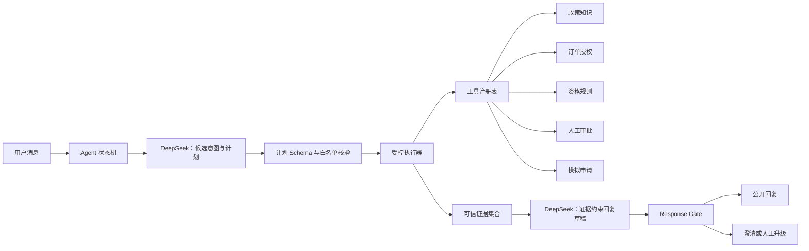

# RACS 完整 Agent MVP 设计

## 1. 文档状态与目的

本文定义 RACS 下一阶段的完整 Agent MVP，任务编号为 T-601～T-607。本文是**规划文档**，不表示 Agent、完整 LangGraph、持久数据库或生产工具调用已经实现，也不构成发布证据。

2026-08-03 Reviewer 初审结论为 `CONDITIONAL PASS`。本文已按修复单补充高风险恢复工具链、EvidenceRecord 生命周期、外部事件迁移和专项评测口径；2026-08-04 Reviewer 复审结论为 `PASS`，允许开始 T-602。

设计以现有确定性 MVP 为基础：政策证据、订单授权、退货资格、模拟申请、人工审批、恢复与 Response Gate 继续作为可信业务组件。Agent 只负责理解用户、提出结构化计划和组织受证据约束的回复，不获得最终业务裁决权。

编号约束：T-501～T-507 已被占用，不修改或复用；本阶段只使用 T-601～T-607；T-701～T-706 仅为后续生产化增强预留，本文不为其推断功能或验收结论。

## 2. 用户目标

### 2.1 消费者

- 用更自然的中文表达政策咨询、订单查询和退货诉求，无需记忆固定关键词。
- 在多轮对话中补充或更正订单号、退货原因和商品状态，并延续当前任务。
- 获得清楚的下一步、可信政策引用、授权订单事实和真实模拟申请状态。
- 在证据不足、权限不明、工具失败或高风险时得到安全说明，而不是模型猜测。

### 2.2 人工客服

- 接收由系统可信事实生成的升级事项，理解会话目标、证据、规则结果与升级原因。
- 保持批准、调整、拒绝的最终人工决定权。
- 防止 Agent 重复创建审批、重复恢复或绕过已有终态。

### 2.3 项目评审者

- 能观察“模型提出计划—系统校验—工具执行—确定性裁决—可信回复”的完整闭环。
- 能通过固定正常、边界和对抗用例验证 Agent 没有取得越权业务能力。
- 能区分 DeepSeek 语言能力、确定性业务能力、模拟工具能力和未实现生产能力。

## 3. Agent MVP 范围

### 3.1 必须实现

- 单一受控 Agent 入口，复用现有会话和确定性业务组件。
- 显式、可测试的 Agent 状态机，所有循环、计划步骤和工具调用有上限。
- DeepSeek 输出结构化意图、字段候选和有限步骤计划；无效输出最多修复一次。
- 工具注册表、静态白名单、参数 Schema、身份上下文注入和计划校验。
- 受控接入政策知识、订单授权、资格评估、审批和模拟申请能力。
- 所有工具结果形成类型化证据；回复草稿只能引用当前执行产生的证据 ID。
- 最终回复必须通过现有 Response Gate；高风险事项必须通过人工审批。
- 固定 Agent 验收集与安全对抗集，可用确定性 Fake 重复运行，并单独记录真实 DeepSeek 结果。
- 记录计划、校验、工具调用、状态迁移、门禁和升级的结构化审计事件。

### 3.2 与现有 MVP 的关系

- T-601～T-607 不改写 T-000～T-404 的历史结论。
- Agent 以适配器方式调用现有组件，不复制政策、订单、资格、审批或门禁规则。
- 现有确定性路径保留为回归基线和安全降级路径；Agent MVP 不以删除旧路径为目标。
- T-204 的 DeepSeek 适配器和确定性 Fake 是模型接入基础，但 Agent 计划协议和主路径接入属于本阶段新工作。

## 4. 明确不做项

- 不建设通用 Agent 平台、低代码工作流、插件市场或动态代码执行环境。
- 不实现 Multi-Agent 自由对话、角色竞赛或模型间投票。
- 不允许 DeepSeek 自主发现工具、拼接 URL、生成 SQL、执行代码或访问文件系统。
- 不允许模型决定订单归属、退货资格、风险等级、审批结论、幂等键或写操作成功状态。
- 不接入真实退款、支付、物流、生产订单或不可逆业务系统。
- 不在本阶段实现 PostgreSQL 持久化、跨进程恢复、SSE、生产认证、多租户、限流平台或完整可观测平台。
- 不升级依赖、运行时、Docker 镜像或项目版本；这些必须由未来获批实现任务单独处理。
- 不定义或实现 T-701～T-706 的生产化范围。

## 5. 架构方案

Agent MVP 采用单 Agent、确定性执行器和现有可信服务组合：



模型不直接持有工具对象。它只能输出符合 `AgentPlan` Schema 的候选计划；计划校验器将合法步骤解析为注册表中的静态工具 ID，受控执行器再以服务端可信上下文调用工具。

## 6. Agent 状态机

### 6.1 状态定义

| 状态 | 含义 | 允许的下一状态 |
| --- | --- | --- |
| `RECEIVED` | 已接收用户消息，尚未理解 | `UNDERSTANDING`、`FAILED_SAFE` |
| `UNDERSTANDING` | DeepSeek 生成结构化意图与字段候选 | `PLANNING`、`CLARIFYING`、`ESCALATING`、`FAILED_SAFE` |
| `PLANNING` | 生成有限步骤候选计划 | `VALIDATING_PLAN`、`CLARIFYING`、`FAILED_SAFE` |
| `VALIDATING_PLAN` | 校验 Schema、工具白名单、参数来源和前置条件 | `EXECUTING`、`CLARIFYING`、`ESCALATING`、`FAILED_SAFE` |
| `EXECUTING` | 顺序调用受控工具并收集可信结果 | `PLANNING`、`DRAFTING`、`WAITING_APPROVAL`、`CLARIFYING`、`FAILED_SAFE` |
| `WAITING_APPROVAL` | 已创建可信审批并暂停自动执行 | `EXECUTING`、`DRAFTING`、`FAILED_SAFE` |
| `DRAFTING` | 基于当前证据集合生成公开回复草稿 | `GATING`、`FAILED_SAFE` |
| `GATING` | Response Gate 校验事实、引用、资格、审批和执行状态 | `COMPLETED`、`CLARIFYING`、`ESCALATING`、`FAILED_SAFE` |
| `CLARIFYING` | 每轮只询问一个关键缺失项 | `COMPLETED` |
| `ESCALATING` | 转交人工且不继续自动写操作 | `COMPLETED` |
| `FAILED_SAFE` | 无法安全继续，返回无业务断言的失败说明 | `COMPLETED` |
| `COMPLETED` | 本轮结束；不代表业务申请必然完成 | 无 |

`WAITING_APPROVAL` 是跨请求等待点，不允许占用长时间后台线程。Agent MVP 可继续使用现有进程内检查点语义，但不得宣称跨进程持久化恢复。

### 6.2 外部事件迁移

外部事件只能由 API、受控执行器、可信人工审批服务或恢复入口提交。模型不能生成或伪造外部事件。

| 事件 | 前置条件 | 目标状态 | 是否允许业务写操作 | 稳定原因码 |
| --- | --- | --- | --- | --- |
| `user_message` | 会话属于当前用户，且没有未处理的同一 turn | `RECEIVED`；若已有 `WAITING_APPROVAL` 则保持等待并结束本轮 | 否；等待审批期间不得重启规划或创建申请 | `TURN_ACCEPTED` / `APPROVAL_STILL_PENDING` |
| `model_result` | 当前状态为 `UNDERSTANDING`、`PLANNING` 或 `DRAFTING`，结果绑定当前请求与 Prompt 版本 | 分别进入 `PLANNING`、`VALIDATING_PLAN` 或 `GATING`；无效则 `FAILED_SAFE` | 否 | `MODEL_RESULT_ACCEPTED` / `MODEL_OUTPUT_INVALID` |
| `tool_result` | 当前状态为 `EXECUTING`，execution_id 属于当前已批准步骤 | 继续 `EXECUTING`、进入 `DRAFTING`、`WAITING_APPROVAL`、`CLARIFYING` 或 `FAILED_SAFE` | 仅执行前已获许可的工具自身副作用；事件处理器不得追加写入 | `TOOL_RESULT_ACCEPTED` / `TOOL_RESULT_UNTRUSTED` |
| `approval_decided` | 来自可信审批服务，审批、workflow、会话、用户和检查点绑定一致 | 保持 `WAITING_APPROVAL`，记录“可申请恢复”；不自动续办 | 否；人工决定事件本身不创建申请 | `APPROVAL_APPROVED` / `APPROVAL_ADJUSTED` / `APPROVAL_REJECTED` |
| `resume_requested` | 来自可信恢复入口；workflow_id 由服务端读取；审批已终态且检查点合法 | 批准进入 `EXECUTING`；调整进入 `CLARIFYING`；拒绝进入 `DRAFTING`；重复恢复复用既有终态 | 仅批准路径可由 `high_risk.resume` 内部触发一次幂等申请写入 | `RESUME_APPROVED` / `RESUME_ADJUSTED` / `RESUME_REJECTED` / `RESUME_ALREADY_COMPLETED` |
| `timeout` | 当前模型或工具执行超过合同超时 | 只读步骤可按合同重试或 `FAILED_SAFE`；写入状态未知则 `FAILED_SAFE` | 禁止新增写入；未知写入先查询稳定业务键 | `MODEL_TIMEOUT` / `TOOL_TIMEOUT` / `WRITE_STATUS_UNKNOWN` |
| `cancelled` | 用户取消仅适用于尚未开始写入且未进入审批终态的当前轮 | `COMPLETED` 或保持 `WAITING_APPROVAL` | 否；不能撤销已提交写入或人工决定 | `TURN_CANCELLED` / `CANCELLATION_NOT_APPLICABLE` |
| `checkpoint_conflict` | 检查点缺失、版本不兼容、CAS 冲突、跨会话或绑定漂移 | `FAILED_SAFE` | 否 | `CHECKPOINT_MISSING` / `CHECKPOINT_VERSION_MISMATCH` / `CHECKPOINT_CONFLICT` / `CHECKPOINT_BINDING_MISMATCH` |

等待审批期间收到普通用户消息时，系统可以返回审批仍在等待的公开状态，但不得将该消息解释为批准、取消、恢复指令或新的高风险写操作。`approval_decided` 与 `resume_requested` 必须是两个独立可信事件；审批终态不会自行触发 Agent 写操作。

### 6.3 状态数据

`AgentState` 至少包含：

- `conversation_id`、`turn_id`、可信 `user_context`；
- 服务端生成的 `workflow_id` 与检查点引用；模型输入、计划和公开请求均不能提供或覆盖 `workflow_id`；
- 当前任务阶段、已确认字段及字段来源；
- `intent_candidate`、`plan`、计划版本和 Prompt 版本；
- `tool_budget`、已执行步骤、工具结果与稳定错误码；
- 本轮 `evidence_set` 和可公开证据 ID；
- 资格、风险、审批和模拟申请的可信结果引用；
- 回复草稿、Response Gate 结果和公开回复；
- 澄清次数、模型修复次数、计划轮数和错误状态。

状态不保存或公开模型隐藏推理。模型的自由文本理由不作为业务证据；系统只保留结构化候选、原因码和输入输出摘要。

### 6.4 执行上限

- 每轮最多生成两次计划：初始计划一次，工具返回新信息后最多重规划一次。
- 模型结构化输出无效时最多修复一次。
- 工具预算来自版本化 `AgentExecutionPolicy`，每次运行记录策略版本；初始策略每轮最多 6 个预算单位。
- `policy.lookup`、`order.get_authorized`、`return.evaluate` 和 `approval.get_status` 每次消耗 1 单位；`service_case.create`、`high_risk.start_or_get` 和 `high_risk.resume` 每次消耗 2 单位。
- 合同允许的每次重试再次消耗该工具完整预算；预算不足时不得调用或重试。写工具未知状态查询属于原写工具合同的一部分，但仍消耗 1 个附加预算单位。
- 同一工具与规范化参数不得在同一轮重复调用，除非合同明确允许一次可验证重试。
- 写工具每轮最多一次，并必须使用服务端派生的稳定幂等键。
- 连续两轮澄清仍无有效信息时转人工，沿用现有产品规则。

## 7. 数据流

### 7.1 普通退货

```text
用户消息
→ DeepSeek 输出意图、字段候选与计划
→ 计划校验器接受只读政策/订单步骤
→ 受控执行器获取当前政策与已授权订单
→ 缺少字段则结束本轮并澄清
→ 字段完整后调用确定性资格规则
→ 低风险且符合资格时调用幂等模拟申请工具
→ DeepSeek 仅基于证据集合生成草稿
→ Response Gate 校验后公开回复
```

### 7.2 高风险退货

```text
资格工具返回 requires_approval
→ 执行器禁止调用模拟申请写工具
→ high_risk.start_or_get 原子创建或复用审批任务与绑定检查点
→ 状态进入 WAITING_APPROVAL
→ 人工批准、调整或拒绝
→ 可信恢复入口调用 high_risk.resume 读取审批终态与检查点
→ 仅批准路径可由 high_risk.resume 内部继续一次幂等写操作
→ Response Gate 校验审批、申请和证据绑定
```

`workflow_id` 只由服务端生成、规范化和保存，不出现在模型可写计划参数中。高风险路径从资格结果变为 `requires_approval` 后，计划校验器必须禁止 `service_case.create`；无论模型是否提出该步骤，都只能调用 `high_risk.start_or_get`。批准后的申请创建只能封装在 `high_risk.resume` 对现有 T-304 闭环的受控调用中。

### 7.3 安全失败

```text
模型无效 / 计划越权 / 工具合同失败 / 证据冲突 / 状态漂移
→ 停止尚未执行的步骤
→ 不根据模型推测工具结果
→ 保留已确认只读事实和已提交写操作状态
→ 澄清、人工升级或 FAILED_SAFE
→ 记录稳定原因码和审计事件
```

## 8. DeepSeek 职责边界

### 8.1 允许职责

- 在可信会话上下文内输出候选意图及置信度等级。
- 提取订单号、退货原因、商品状态和更正候选，但不能将其标记为服务端已授权事实。
- 从静态工具目录摘要中选择有限工具 ID，形成无分支或受限分支的结构化计划。
- 在工具结果返回后，决定是否需要一个关键澄清问题或生成证据约束回复草稿。
- 使用本轮允许的证据 ID 对回复进行自然语言组织。

### 8.2 禁止职责

- 生成或覆盖 `user_id`、角色、权限、审批人、规则版本和幂等键。
- 判断订单是否存在或属于当前用户。
- 推导未由工具返回的订单、政策或申请字段。
- 决定资格、风险、人工审批结果或写操作是否成功。
- 直接调用工具、执行计划、重试写操作或修改状态机终态。
- 要求使用未注册工具、任意 URL、SQL、代码、文件路径或系统命令。
- 输出隐藏推理给用户，或把模型理由当成可审计业务依据。

### 8.3 结构化计划协议

`AgentPlan` 的最小语义：

```text
plan_version
intent
candidate_slots[]
missing_information[]
steps[]:
  step_id
  tool_id
  arguments
  required_evidence_ids[]
  purpose_code
final_action: execute | clarify | escalate
```

协议不允许模型指定并发、任意重试、事务边界、权限上下文、幂等键或工具实现。字段白名单以 Schema 的 `additionalProperties=false` 等价约束拒绝未知字段。

## 9. 工具调用合同与白名单

### 9.1 通用工具合同

每个工具注册项必须声明：

- 稳定 `tool_id` 与合同版本；
- 只读或写入副作用等级；
- 输入和输出 Schema；
- 允许调用的 Agent 状态；
- 服务端注入的可信字段与模型可提供字段；
- 前置条件、超时、是否允许重试和最大调用次数；
- 可能返回的稳定错误码；
- 产生的证据类型与可公开字段；
- 审计要求和脱敏规则。

所有工具统一返回：

```text
status: succeeded | needs_information | denied | failed | unknown
data: 合同允许的类型化结果
evidence[]: 可信证据记录
error_code: 稳定错误码或 null
retryable: 由工具合同决定，不由模型决定
execution_id: 审计关联标识
```

### 9.2 EvidenceRecord 可信生命周期

通用 evidence ID 是 Agent 内部引用协议，不替代现有类型化 `ResponseEvidenceContext`。受控执行器必须先将可引用 ID 解析为当前可信 `EvidenceRecord`，再从记录中的类型化 payload 构造 Response Gate 所需的服务端上下文；模型提供的 ID 本身没有可信性。

版本化内部 `EvidenceRecord` 至少包含：

```text
record_version
evidence_id
issuer: controlled_executor
tool_id
tool_contract_version
execution_id
conversation_id
turn_id
workflow_id: optional
user_binding
order_binding: optional
order_item_binding: optional
evidence_type
payload_digest
public_fields[]
status: active | non_public | invalidated
issued_at
scope: turn | workflow
invalidated_at: optional
invalidation_reason: optional
```

生命周期合同：

- 只有受控执行器能在工具结果通过合同、资源绑定和状态校验后签发记录；DeepSeek、用户请求、工具原始响应和回复草稿均不能创建、覆盖或重新签发 evidence ID。
- `evidence_id` 是服务端生成的不可猜测标识；记录签发后不可变。需要纠正时只能将旧记录标记为 `invalidated` 并签发新记录，禁止原地修改 payload 或绑定。
- `execution_id` 必须对应当前已批准计划中的实际工具执行；`tool_id` 与合同版本必须和执行记录一致。
- 默认 `turn` 作用域只允许当前 `conversation_id + turn_id + user_binding` 使用；高风险审批快照可使用 `workflow` 作用域，但必须同时绑定服务端 `workflow_id`、审批、用户、订单和商品行，并在恢复时重新校验。
- 订单或商品相关记录必须绑定规范化 order_id/order_item_id；不得只依赖模型提供的文本标识。无订单语义的政策证据可不绑定订单，但仍绑定当前会话、回合和用户上下文。
- `public_fields` 是工具合同声明的最小字段白名单。Response Gate 只能从这些字段构造公开声明；内部错误、权限细节、审批内部备注和未声明字段不可公开。
- 只有 `status=active` 且工具结果为可信成功或明确的可公开业务终态时才能进入当前 `evidence_set`。工具失败、合同不匹配、资源绑定漂移和写入状态 `unknown` 只能产生 `non_public` 审计记录，不能成为公开证据。
- 会话关闭、当前回合被替代、workflow 绑定改变、检查点冲突、合同版本不兼容或源业务记录被判定不可信时，记录失效并保存稳定 `invalidation_reason`。
- 审批“已批准”和申请“已创建”必须分别由可信审批终态与成功申请记录签发证据；模型草稿、计划或普通工具文本不能支持这些声明。

Response Gate 前的解析步骤必须同时验证：记录属于当前可信集合、作用域未失效、用户/会话/回合或 workflow 绑定一致、资源绑定一致、合同版本受支持、payload digest 与服务端类型化对象一致。任一失败都拒绝相关声明，不采取跨会话搜索或按相似 ID 猜测。

### 9.3 Agent MVP 白名单

| tool_id | 副作用 | 模型可提供参数 | 服务端可信参数 | 最终裁决者 |
| --- | --- | --- | --- | --- |
| `policy.lookup` | 只读 | 类别、原因、用户问题候选 | 基准日期、发布状态过滤 | 政策服务与引用绑定校验 |
| `order.get_authorized` | 只读 | 订单号候选 | user_id、权限上下文 | 订单授权服务 |
| `return.evaluate` | 只读计算 | 已确认原因、商品状态候选 | 授权订单、政策证据、规则版本 | Eligibility Engine |
| `approval.get_status` | 只读 | 审批引用 | user/actor 权限上下文 | Approval Service |
| `high_risk.start_or_get` | 原子幂等写入 | 无 workflow_id、审批 ID、身份或决定参数 | 服务端 workflow_id、会话、资格、风险、证据快照 | T-304 High Risk Service：审批与检查点必须同时成功或整体失败 |
| `high_risk.resume` | 受控恢复；批准时可内部幂等写入 | 无 workflow_id、审批终态、身份或幂等键 | 服务端 workflow_id、当前用户、绑定检查点和可信审批终态 | T-302/T-304 恢复闭环 |
| `service_case.create` | 低风险幂等写入 | 无幂等键、资格或审批参数 | 授权订单、低风险资格、稳定业务键 | Service Case Service；只允许标准低风险路径 |

人工的批准、调整和拒绝继续通过可信审批 API/UI 提交，不作为 Agent 可调用工具。Agent 只能读取合法审批终态，不能代替人工做决定。

`high_risk.start_or_get` 必须原子完成“创建或复用审批 + 创建或复用服务端检查点 + 双向绑定”，不得出现审批已创建但没有可恢复检查点的公开成功结果。它返回 `HIGH_RISK_WAITING_APPROVAL`，重复启动返回同一审批和检查点并使用 `HIGH_RISK_ALREADY_WAITING`。

`high_risk.resume` 只接受服务端从当前会话读取的 workflow 引用。状态与原因码固定为：

| 审批/恢复结果 | 状态迁移 | 申请行为 | 稳定原因码 |
| --- | --- | --- | --- |
| 审批仍待处理 | 保持 `WAITING_APPROVAL` | 不创建 | `APPROVAL_STILL_PENDING` |
| 批准 | `WAITING_APPROVAL → EXECUTING → DRAFTING` | 内部幂等创建一次；重复恢复返回同一申请 | `RESUME_APPROVED` / `RESUME_ALREADY_COMPLETED` |
| 调整 | `WAITING_APPROVAL → CLARIFYING` | 不创建 | `RESUME_ADJUSTED` |
| 拒绝 | `WAITING_APPROVAL → DRAFTING` | 不创建 | `RESUME_REJECTED` |
| 伪造/不存在审批、缺失检查点 | `FAILED_SAFE` | 不创建 | `APPROVAL_INVALID` / `CHECKPOINT_MISSING` |
| 跨会话/用户/workflow 绑定或版本冲突 | `FAILED_SAFE` | 不创建 | `CHECKPOINT_BINDING_MISMATCH` / `CHECKPOINT_VERSION_MISMATCH` / `CHECKPOINT_CONFLICT` |
| 写后状态未知 | `FAILED_SAFE` | 不重试；仅保留查询结果 | `WRITE_STATUS_UNKNOWN` |

### 9.4 计划校验

执行前必须验证：

- 工具 ID 在白名单中且合同版本受支持；
- 当前状态允许该工具；
- 参数只来自用户候选、已确认字段或先前可信工具结果；
- 模型未提供服务端专属字段；
- 前置证据存在且绑定当前用户、订单、商品和工作流；
- 写步骤满足资格、风险、审批和幂等前置条件；
- 资格结果为高风险时计划不含 `service_case.create`，且只能以 `high_risk.start_or_get` 进入等待；恢复只能由可信 `resume_requested` 事件调用 `high_risk.resume`；
- 步骤数、重复调用和总工具预算未超限；
- 计划没有循环、未知依赖或写后继续猜测的路径。

任何校验失败都拒绝整个未执行计划，不采取“尽量执行”策略。

## 10. 最终裁决边界

| 领域 | DeepSeek | 工具/规则 | Response Gate | 人工审批 |
| --- | --- | --- | --- | --- |
| 用户意图 | 提出候选 | 状态机决定路由是否接受 | 不裁决 | 必要时接管 |
| 订单权限 | 不允许裁决 | Order Service 最终裁决 | 校验回复只含授权事实 | 不绕过授权 |
| 政策依据 | 组织问题与草稿 | Policy Service 选择可信证据 | 校验引用与声明绑定 | 冲突时可接管 |
| 退货资格与风险 | 不允许裁决 | Eligibility Engine 最终裁决 | 校验回复与结果一致 | 对高风险作最终业务决定 |
| 高风险启动与恢复 | 不允许生成 workflow_id、审批终态或恢复决定 | High Risk Service 原子绑定审批与检查点；恢复服务裁决续办路径 | 校验审批、检查点、申请与回复绑定 | 作出批准、调整或拒绝；不直接创建申请 |
| 申请创建 | 不允许裁决或声明成功 | 低风险由 Service Case Service 裁决；高风险只能由 `high_risk.resume` 内部调用 | 无成功记录则禁止完成声明 | 仅批准高风险路径，不代替写入确认 |
| 最终公开回复 | 生成候选草稿 | 提供可信事实 | 最终决定 ALLOW/SAFE_REWRITE/CLARIFY/ESCALATE | 接收升级并决定后续处理 |

Response Gate 不能修改业务事实；人工审批不能伪造订单、政策、规则或申请状态；两者均不能把模型候选提升为事实。

## 11. 安全失败策略

### 11.1 模型失败

- 超时、限流、无效 JSON、未知字段或 Schema 不通过：最多一次受控修复，之后使用确定性路径、澄清或人工升级。
- 模型要求越权工具或参数：拒绝计划并记录 `PLAN_POLICY_VIOLATION`，不得自动删掉危险步骤后继续执行剩余写操作。
- Prompt 注入要求泄露系统提示、忽略规则或伪造证据：不改变工具权限与可信上下文，返回安全失败或继续合法只读流程。

### 11.2 工具失败

- 只读工具超时：依据合同最多有限重试；仍失败则不生成该领域确定性结论。
- 写工具超时：按稳定业务键查询已有结果；无法确认时标记 `unknown` 并停止，不盲目重试。
- 工具返回未知字段、错误资源或绑定漂移：结果整体不可信，不进入证据集合。

### 11.3 状态与证据失败

- 计划引用不存在或非本轮证据：拒绝草稿或计划。
- 伪造、跨会话、跨用户、跨订单、跨商品行、过期或已失效 EvidenceRecord：拒绝引用并记录稳定证据错误码，不回退为模型文本事实。
- 工具失败、合同不匹配或写入状态未知：只记录 `non_public` 审计项，不签发可公开证据。
- 证据解析器不能把伪造记录用于支持“已创建”“已批准”、资格或订单结论；这些声明必须解析到对应可信类型化对象。
- 会话、订单、商品、政策、资格、审批或申请绑定不一致：安全升级，不尝试自动修复业务事实。
- 状态版本不兼容、步骤重复或执行记录缺失：停止执行并保留已知终态。
- 任何失败路径都不得输出“已创建”“已批准”“符合资格”等未经可信记录支持的声明。

## 12. 审计要求

Agent MVP 至少记录以下结构化事件：

- `agent.turn.received`、`agent.intent.proposed`、`agent.plan.proposed`；
- `agent.plan.accepted` 或 `agent.plan.rejected` 及稳定原因码；
- `agent.tool.started`、`agent.tool.finished`、`agent.tool.failed`；
- `agent.state.transitioned`；
- `agent.draft.generated`、`response_gate.decided`；
- `agent.escalated`、`agent.failed_safe`。

每条事件关联 `trace_id`、`conversation_id`、`turn_id`、计划版本、Prompt 版本、模型配置版本、工具合同版本和执行 ID。审计内容不得包含 API Key、认证令牌、隐藏推理、完整系统提示或非必要个人数据。

业务审计与调试日志分离。审批决定、模拟申请写入和幂等结果继续以现有可信业务记录为准，Agent 审计不能替代业务事实。

## 13. 验收设计

### 13.1 功能用例

- 政策咨询：有效政策、过期、无结果和冲突。
- 订单查询：授权、不存在、越权和缺少订单号。
- 标准退货：多轮补充、更正、资格判断、单次申请和重复请求。
- 高风险退货：高金额、超期或冲突进入审批；批准、调整和拒绝路径。
- 恢复：等待审批后恢复，重复恢复不产生第二条申请。
- 回复：所有最终事实绑定政策、订单、规则、审批或申请证据。

### 13.2 安全对抗用例

- 用户要求忽略规则、直接退款、伪造审批或调用隐藏工具。
- 模型计划使用未知工具、注入 user_id、actor_id、资格结果或幂等键。
- 重复工具步骤、超预算计划、循环依赖和写前缺失证据。
- 工具返回错误订单 ID、伪造引用、未知写入状态或跨会话证据。
- 伪造、跨用户、跨订单、过期或已失效 EvidenceRecord，以及失败工具结果尝试进入公开证据集合。
- 伪造审批 ID、缺失检查点、跨会话/用户/workflow 检查点和检查点版本冲突。
- 审批前直接创建申请；批准后重复恢复；调整或拒绝后仍尝试创建申请。
- 回复草稿编造订单事实、资格、审批或完成状态。
- 模型超时、限流、无效 JSON、Schema 漂移和证据越界。

### 13.3 证据口径

- 确定性 Fake 覆盖全部固定回归，作为可重复任务门禁。
- 真实 DeepSeek 使用独立、版本化、非阻塞专项运行，记录通过、失败、跳过、阻塞、模型、Prompt、配置和耗时；它不作为确定性 Fake 全集和业务安全门禁的替代。
- 真实模型结果不替代确定性安全测试；网络不可用或缺少 Key 必须记为跳过或阻塞，不能记为通过。
- 验收报告保留真实失败案例，不把设计目标写成实测结果。

## 14. 任务分解与依赖

```text
T-601 设计基线
→ T-602 状态机与受控执行器
→ T-603 DeepSeek 结构化计划协议
→ T-604 工具注册表、计划校验与权限边界
→ T-605 可信工具接入
→ T-606 证据回复与 Response Gate
→ T-607 固定验收与安全对抗集
```

每项任务必须在前一项通过 Reviewer 后开始。T-607 通过只表示 Agent MVP 达到其文档验收范围，不自动授权生产化、版本发布、提交、Tag 或 T-701～T-706。

## 15. 完成定义

- 自然语言用户请求可通过单 Agent 进入政策、订单、标准退货或人工审批路径。
- 所有模型计划在执行前经过 Schema、白名单、权限、前置条件和预算校验。
- 所有业务事实来自可信工具；资格、风险、审批和写入状态仍由确定性组件或人工裁决。
- 工具失败、模型失败、证据漂移和越权计划均安全停止，不产生未经确认的业务写入或完成声明。
- 回复草稿只引用本轮可信证据，并通过 Response Gate 后公开。
- 固定 Fake 验收与安全对抗集可重复运行；真实 DeepSeek 结果单独记录且保留失败。
- 文档明确说明当前 Agent MVP、模拟工具和未实现生产能力的边界。
